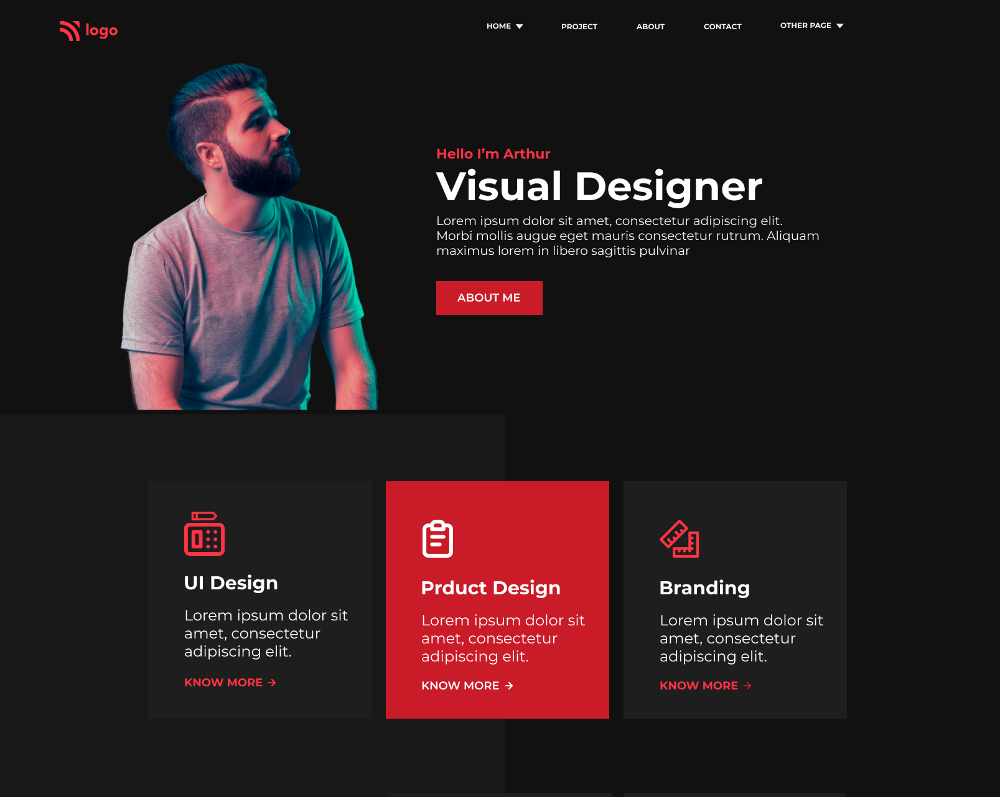

# [Project 15](https://jagadeeshproject15.netlify.app/)

 

# [Product Design Landing Page](https://jagadeeshproject15.netlify.app/)

  

  

>**Learnings from the project**

- media-queries & responsiveness
- more on flex, flex-properties
- positions, z-index
- working with background properties

  

  &nbsp; 

 
